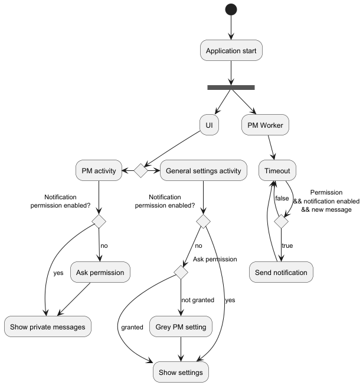

# 2. add-notifications-permission

Date: 2025-05-01

## Status

Accepted

## Context

Starting from Android 13, application notifications are opt-in. We need to ask the user for the
permission to push notifications.

## Decision

I decided to ask the permission in the right context: when going in the general settings, where
the user can enable/disable notifications or when going in the private messages.

## Consequences

The private messages worker can be started in multiple places.

